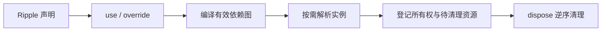
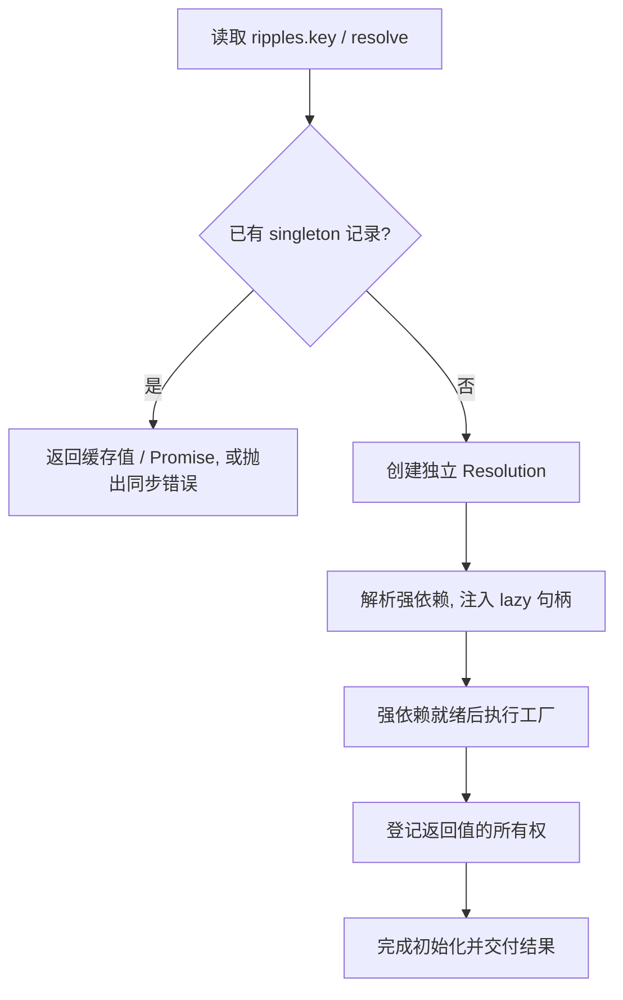

# Cyrene 固定依赖图设计

**配置阶段确定依赖图, 解析阶段按需创建真实实例, 关闭阶段统一清理资源。**

[模型](#模型) · [配置阶段](#配置阶段) · [解析](#解析) · [关闭](#关闭) · [诊断与类型边界](#诊断与类型边界)

## 模型

| 对象          | 保存什么                             | 何时使用                     |
| ------------- | ------------------------------------ | ---------------------------- |
| Ripple        | 不可变 key、输入与工厂配方           | 声明服务与引用依赖           |
| Registry      | 原声明、当前实现与依赖边             | 构图校验与解析定位           |
| Resolution    | 一次初始化的状态、值、错误与等待关系 | 缓存单例或追踪独立 transient |
| ResourceStore | 弱引用所有权与有序待清理资源         | 去重、冲突检查与关闭         |

每个容器独立持有这些运行时数据。工厂收到真实依赖实例, 依赖图在首次解析时锁定。

### 模块职责

| 模块                          | 职责                         |
| ----------------------------- | ---------------------------- |
| `ripple` / `dependency`       | 声明重载、工厂配方与身份     |
| `registry`                    | 依赖收集、覆盖应用与图校验   |
| `cyrene`                      | 配置、解析、等待环检测与关闭 |
| `resources`                   | 所有权登记与资源清理         |
| `lazy`                        | 延迟依赖声明                 |
| `types` / `utils` / `symbols` | 类型契约、输入处理与声明标记 |
| `format-graph`                | 诊断快照格式化与终端字符清理 |

## 配置阶段

### 注册与编译

1. `new Cyrene()` 创建空容器; `use(...declarations)` 整批验证并登记公开入口。
2. 首次 `resolve()` 或显式 `inspect()` 时, 从入口收集有效实现的强依赖与 lazy 目标。
3. 校验声明身份、key 冲突、覆盖目标可达性与强依赖环。
4. 成功后缓存完整 Registry; 配置变更使缓存失效, 失败不缓存半成品。

| 规则                     | 结果                                    |
| ------------------------ | --------------------------------------- |
| 同一声明重复 `use()`     | 幂等, 返回同一容器                      |
| 不同原声明使用相同 key   | 报错                                    |
| 仅作为依赖被收集         | 可通过 `resolve()` 访问, 不增加公开属性 |
| 内部依赖后来显式 `use()` | 提升为公开入口                          |
| 普通输入或嵌套对象       | 原样传递, 不递归收集                    |

lazy 回调在构图时求值, 必须稳定且无副作用; 配置不变时复用编译结果。

### 覆盖与锁定

`override(original, replacement)` 以原声明定位, 使用替身的工厂、依赖和 lifetime。

- 保留原 key 与公开范围, 替身须兼容原返回值和同步 / 异步契约。
- 只收集有效实现的依赖, 原实现独有的依赖被裁剪。
- 允许先覆盖后注册; 同一目标最后一次覆盖生效, 覆盖回原声明可恢复原实现。
- 原声明与当前替身都映射到原 key; 旧替身不再保留映射。

**配置锁定于第一次解析尝试**, 即使构图或初始化失败也不解锁。`inspect()` 不锁定配置。

覆盖校验的边界

- 覆盖目标必须是有效图中可达的原声明; 被上层覆盖裁剪掉的目标同样报错。
- 一个声明只能对应一个注册 key; 同一替身不能同时服务多个覆盖或独立节点。
- 图校验基于运行时声明身份, 不根据 TypeScript 结构相似性判断环。
- 激活后不可继续 `use()` 或 `override()`; 需要另一套图时创建新容器。

## 解析

### 创建流程

属性入口是只读访问器视图, 服务实例本身不代理。声明解析只查找已注册图中的身份, 不自动注册未知声明。

### 生命周期与结果

| 行为       | singleton (默认)       | transient                    |
| ---------- | ---------------------- | ---------------------------- |
| 初始化记录 | 执行工厂前写入缓存     | 每次解析独立创建             |
| 同步结果   | 缓存实例               | 每次重新执行工厂             |
| 异步结果   | 始终返回同一个 Promise | 独立 Promise, 不合并并发请求 |
| 创建失败   | 缓存失败               | 下次解析重新尝试             |
| 注入消费者 | 复用同一单例           | 每个输入属性独立解析         |

- singleton 消费者只在首次初始化时创建并持有其 transient 依赖。
- 工厂和全部强依赖同步时直接返回实例, 否则返回 Promise。
- 强依赖并行初始化; 某分支失败时仍等待同批所有分支结束, 避免遗漏晚到资源。
- 普通 Promise 输入原样传递; lazy 目标的异步性只影响句柄解析结果。
- 同步失败直接抛错, 异步失败拒绝 Promise; 已登记资源等待调用方关闭容器。

### lazy 与等待环

lazy 注入绑定当前容器的解析句柄。**启动异步初始化与等待结果是两个时机。**

| 操作                          | 等待关系                           |
| ----------------------------- | ---------------------------------- |
| 仅调用 `lazy.resolve()`       | 不登记                             |
| `await` 或返回给异步工厂      | 登记                               |
| `then` / `catch` / `finally`  | 登记, 包括旁路观察回调             |
| 目标完成, 或消费者成功 / 失败 | 清除对应等待边或消费者的全部等待边 |

等待边连接具体 `Resolution`, 互不关联的 transient 实例不会被合并。

重入、递归与 Promise 身份

- 同步执行栈拦截公共解析重入; 尚在初始化的创建链不能递归展开同一声明。
- transient 就绪后的 lazy 句柄可以再次创建同声明的新实例。
- lazy 启动的子服务可等待仍在执行的异步父工厂; 父工厂真正等待子服务时会检测出环。
- 同步父工厂无法通过延迟 Promise 交付同步实例, 此类同步环会被拒绝; 已返回资源仍登记清理。
- 初始化期间, 同一句柄按目标 Resolution 复用 `LazyPromise` 包装, 身份与公共入口不同。
- 消费者就绪后直接返回解析结果: singleton 复用缓存, transient 重新创建。
- 读取失败的异步记录仍返回原拒绝 Promise, 读取同步失败记录直接抛错。
- 等待关系仅用于初始化检测, 不参与资源清理排序。

## 关闭

### 容器状态

| 状态          | 可执行操作                         |
| ------------- | ---------------------------------- |
| `configuring` | 注册、覆盖、检查图、开始解析或关闭 |
| `active`      | 按需解析、检查图或关闭             |
| `disposing`   | 仅已接收的初始化可继续解析依赖     |
| `disposed`    | 重复关闭返回同一个 Promise         |

`dispose()` 立即进入 `disposing`, 保存唯一关闭 Promise, 然后等待初始化并清理资源。
正在初始化的工厂可继续完成强依赖和 lazy 解析; 已就绪服务的 lazy 句柄停止接收新工作。

### 所有权与保留

| 实例                                     | 记录方式                        | 清理责任             |
| ---------------------------------------- | ------------------------------- | -------------------- |
| owned + 工厂返回时已声明 Symbol 清理协议 | 有序强引用列表 + WeakMap 所有权 | 容器关闭时清理       |
| 普通对象                                 | WeakMap 所有权                  | 无 Symbol 清理行为   |
| borrowed                                 | WeakMap 所有权                  | 应用管理             |
| singleton 结果                           | 额外保存在解析缓存              | 不改变上述所有权规则 |

- 同一对象只登记一次, 重复返回不改变首次完成位置。
- 同一对象混用 owned / borrowed 会报错, 保留原清理责任。
- 清理协议 getter 在关闭时求值; `Symbol.asyncDispose` 优先于 `Symbol.dispose`。
- 普通 `.dispose()` 与选项式 disposer 不参与清理协议。

### 清理顺序与责任

1. 等待所有已接收的初始化结束, 包括期间新增的依赖初始化。
2. 按资源首次成功登记的逆序逐个等待清理。
3. 某项失败后继续清理其余资源, 最后聚合报告错误。
4. 清空运行时缓存和资源记录, 状态进入 `disposed`。

**应用先停止并等待业务任务, 再关闭容器。** 容器只追踪初始化, 不追踪业务方法、流或后台任务。

资源边界

- 强依赖先完成, 消费者通常先清理; 真实依赖引用不会提前失效。
- 后来激活的 lazy 依赖和对象别名不额外按拓扑排序。
- owned transient 待清理资源保留到容器关闭, 不提供每次调用后的自动释放或请求作用域。
- 普通 transient 和 borrowed 实例不会被资源表强引用, 无其他引用时可被回收。
- 工厂抛错前分配但尚未返回的资源, 由工厂自行清理。

## 诊断与类型边界

### 诊断

| 字段 / 输出       | 语义                                                |
| ----------------- | --------------------------------------------------- |
| `roots`           | 显式入口                                            |
| `nodes` / `edges` | 完整有效图                                          |
| 节点 `state`      | 该 key 最近一次初始化状态变化, 不聚合并发 transient |
| `formatGraph()`   | 显示原声明 key, 共享和循环节点显示引用标记          |

`inspect()` 返回独立快照, 不执行工厂。格式化时换行和制表符变为空格, ANSI 序列与其余终端控制字符被清除; 原始快照不变。

### 类型

| API / 类型               | 推导与约束                                |
| ------------------------ | ----------------------------------------- |
| `ripple()`               | key 字面量、输入、工厂结果与同步 / 异步性 |
| `Dependency<T, D, A, K>` | 结果、输入声明、异步标记、key             |
| 链式 `use()`             | 仅累积显式入口的 key                      |
| `override()`             | 通过 `NoInfer` 从原声明约束替身           |
| `resolve(Ripple)`        | 从声明推导实例类型                        |
| `resolve(key)`           | 已累积的 key 有精确类型, 其余为 `unknown` |

- 工厂结果使用 `Awaited<T>`, 同步 / 异步信息决定解析入口是否返回 Promise。
- key 泛型擦除为 `string` 后会失去精确属性提示, 应保留推导或显式标注。
- 公共声明只暴露只读 key 与类型标记, 工厂配方保存在内部 WeakMap。
- 消费方声明生成与库打包分别验证, 循环依赖统一留给运行时检查。
